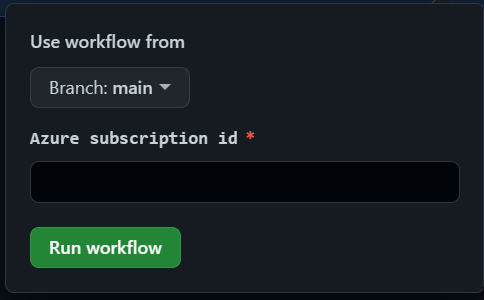

# GitHub Secrets and Azure Login

Demonstrate how GitHub Secrets can be used to simplify Azure OIDC login.

## Overview

This sample provides concise steps to:
- Create a user assigned Azure Managed Identity (MSI).
- Federate the MSI with GitHub for use in GitHub Actions.
- Provide the MSI the required permissions to deploy to a target Resource Group.

## Pre-requisites

1. Install Azure CLI [version 2.45.0](https://learn.microsoft.com/en-us/cli/azure/install-azure-cli-linux?pivots=apt) or newer.

1. Define these variables (change values as needed).

    ``` bash 
    az_subId="xxxxxxxx-xxxx-xxxx-xxxx-xxxxxxxxxxxx"
    az_location="australiaeast"
    az_rgName="nxfutil001"
    az_msiName="GitHubActions"

    gh_org="xxxxxx"         # this repo's organization or your username 
    gh_repo="githubsecrets" # this repo's name
    ```

1. Create target Resource Group.

    ``` bash
    # Create Resource Group
    az group create --name $az_rgName --location $az_location --subscription $az_subId
    ```

1. Create a Managed Identity (user assigned) for GitHub to authenticate with Azure. 

    ``` bash
    # Create MSI
    az identity create --name $az_msiName --resource-group $az_rgName --subscription $az_subId

    # Assign ARM permissions
    az role assignment create --assignee $az_msiName --role 'Contributor' --scope /subscriptions/$az_subId/resourceGroups/$az_rgName

    # Federate with GitHub
    az identity federated-credential create --name "$gh_org--$gh_repo" --identity-name $az_msiName --subject "repo:$gh_org/$gh_repo:ref:refs/heads/main" --issuer "https://token.actions.githubusercontent.com" --resource-group $az_rgName --subscription $az_subId 

    # Show details (needed to create the AZURE_MSI GitHub secret)
    az identity show --name $az_msiName --resource-group $az_rgName
    ```

## Set up

The following uses the provided GitHub workflows to build and deploy the sample.

## Deploy using GitHub


1. Use the JSON output from the pre-requisite steps to create a new `AZURE_MSI` GitHub Secret.

1. Run the workflow called `Azure Managed Identity OIDC Login`.

    